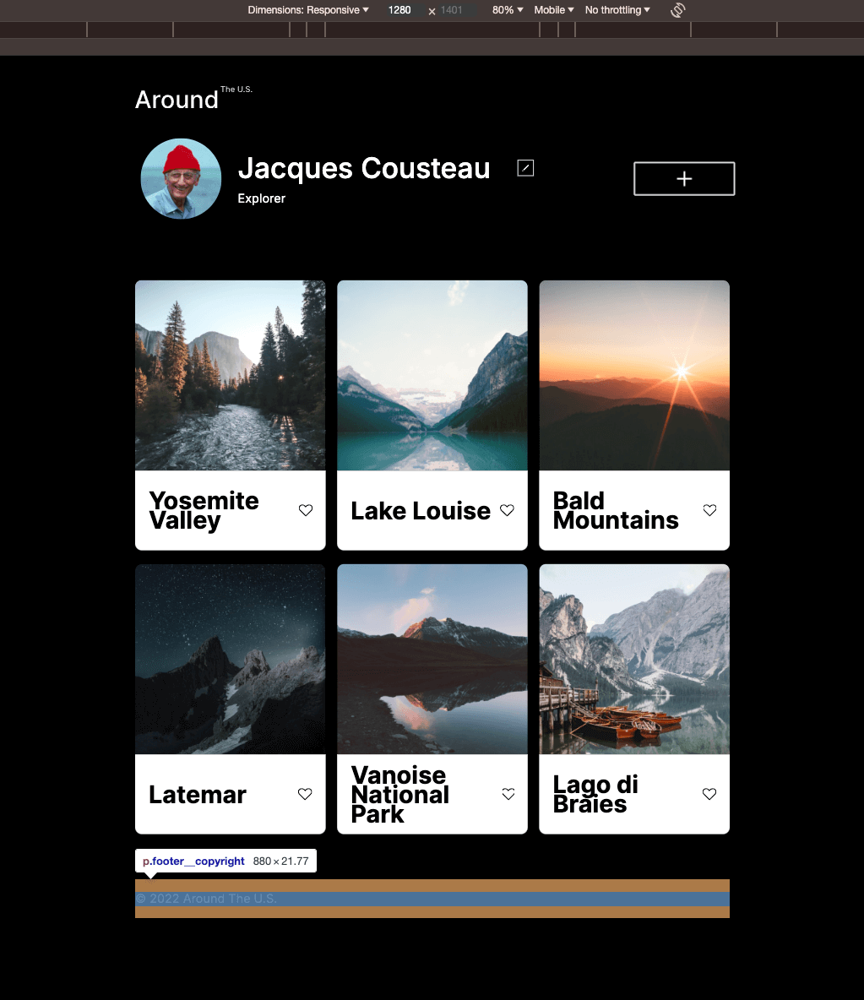

# Project 3: Around The U.S.

**Intro**

<!-- ****REMINDER TO RECORD VIDEO OF PROJECT**** -->

Around the U.S is a web project that showcases various destinations around the United States. It features a profile section displaying information about a user, including their name, description, and an option to edit the profile. Additionally, there is a section displaying cards for different destinations, each containing an image, title, and like button.

Technologies and Techniques Used:
HTML
CSS
BEM (Block Element Modifier) methodology for structuring CSS classes
Responsive design techniques using media queries
Use of flexbox and grid layout for creating responsive and flexible designs

**Images**

LINK: https://mjtor450.github.io/se_project_aroundtheus/

VIDEO: https://drive.google.com/file/d/1geenpvTls7aBvwSGLVDmg3VW2rxXKr4l/view?usp=drive_link
